# Availability Tracker

A Node.js web application for tracking team availability with Redis persistence and CI/CD pipeline.

## Directory Structure & File Details

### `/public/` - Frontend Web Files

Contains all client-side files served by Express server

- **`index.html`** - Main HTML page with form for selecting team members and their availability status
- **`script.js`** - JavaScript that handles form submissions, sends data to `/save-history` endpoint, loads saved data from `/output/history.json`
- **`styles.css`** - CSS styling for the web interface including status colors and responsive design

### `/input/` - Static Data Files

JSON configuration files used by the frontend

- **`names.json`** - Array of team member names displayed in dropdown menus
- **`selection.json`** - Available selection options for the form
- **`status.json`** - Status definitions with colors and labels (Office, Remote, Sick, etc.)

### `/terraform/` - Infrastructure as Code

Google Cloud Platform infrastructure definitions

- **`main.tf`** - Creates Memorystore Redis instance, VPC Access Connector for Cloud Run to reach Redis, Cloud Run service with Redis URL environment variable

### `/ansible/` - Configuration Management

Automation scripts for server setup

- **`playbook.yml`** - Ansible playbook that installs Docker on EC2 instances, updates packages, starts Docker service

### `/__mocks__/` - Test Utilities

Mock objects for testing

- **`redis.js`** - Mock Redis client used in unit tests to simulate Redis operations without actual Redis connection

### Root Directory Files

#### Core Application

- **`server.js`** - Main Express server that:
  - Serves static files from `/public/` and `/input/`
  - Handles POST `/save-history` - saves data to Redis (if available) and file
  - Handles GET `/output/history.json` - retrieves data from Redis or file fallback
  - Provides GET `/healthz` - health check endpoint for Cloud Run
  - Connects to Redis in background, doesn't block startup
- **`package.json`** - Node.js project configuration with dependencies (express, redis, body-parser) and npm scripts for testing, linting, formatting
- **`package-lock.json`** - Locked dependency versions for reproducible builds

#### Containerization

- **`Dockerfile`** - Multi-stage Docker build:
  - Builder stage: installs production dependencies
  - Runtime stage: copies built app, sets PORT=8080, exposes port 8080, runs `node server.js`
- **`docker-compose.yml`** - Local development setup:
  - `app` service: runs teamavail image on port 3000:8080 with Redis URL
  - `redis` service: Redis 7-alpine with persistent volume

#### Testing

- **`server.unit.test.js`** - Unit tests for `saveHistoryToFile()` and `readHistoryFromFile()` functions
- **`server.integration.test.js`** - Integration tests for Express routes (GET /, POST /save-history, 404 handling)

#### CI/CD Pipeline

- **`Jenkinsfile.cloud`** - Jenkins pipeline that:
  - Checks out code, installs dependencies
  - Runs code quality checks (ESLint, Stylelint, HTMLHint, Prettier)
  - Executes unit and integration tests
  - Builds Docker image, pushes to registry
  - Runs Terraform to deploy to GCP
- **`ci.sh`** - Shell script for CI operations (if used)

#### Infrastructure & Configuration

- **`terraform/main.tf`** - GCP resources:
  - `google_redis_instance` - Memorystore Redis instance
  - `google_vpc_access_connector` - VPC connector for Cloud Run to reach Redis
  - `google_cloud_run_service` - Cloud Run service with Redis URL and VPC annotations
  - `google_cloud_run_service_iam_member` - Public access permissions
- **`eslint.config.mjs`** - ESLint configuration for JavaScript code quality
- **`.stylelintrc.json`** - Stylelint configuration for CSS linting rules

## How It Works

1. **Local Development**: `docker-compose up` runs app on port 3000 with Redis
2. **Cloud Deployment**: Jenkins builds image, pushes to registry, Terraform deploys to Cloud Run with Memorystore Redis
3. **Data Persistence**: Saves to Redis when available, falls back to file storage
4. **VPC Access**: Cloud Run connects to Memorystore via VPC Access Connector

## Quick Start

```bash
# Local development
docker-compose up -d

# Access at http://localhost:3000
```

## Environment Variables

- `PORT` - Server port (default: 8080)
- `REDIS_URL` - Redis connection string (e.g., `redis://host:port`)
- `NODE_ENV` - Environment (production/development)

## What Happened When Starting This Project (Timeline & Fixes)

Firist we need a machine to start out project on , so I decide to run on vm in vmworkstation with
centos OS
Project Tasks

1. Set Up the Project locally to test if it works in ur machine or not then configure ci.sh then use jenkins and then move to cloud
   • Clone the project repository.
   

   Create a .gitignore file if missing.
   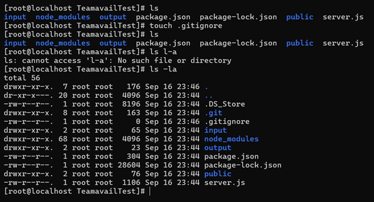

   • Install the required dependencies locally.
   In this step after I run the command (npm install) I faced that I have too old versions of npm and node
   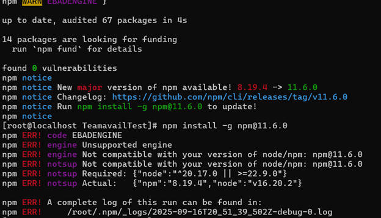
   And to solve it we need to do those steps
   yum remove -y nodejs npm
   curl -fsSL [https://rpm.nodesource.com/setup_20.x](https://rpm.nodesource.com/setup_20.x) | bash -
   yum install -y nodejs
   and then try again (npm install) and try again
   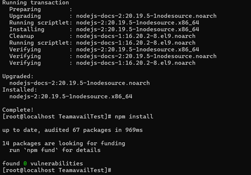
   now run the app and u should to see something like this
   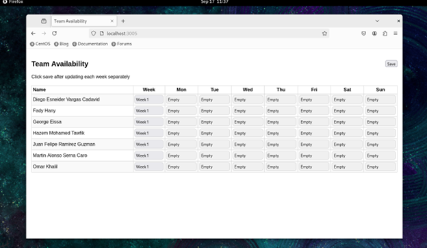
2. Write a Bash Script (ci.sh) This script should:
   • Run code formatting and linting.
   In this step we need some tools for formatting , the tool we will use it Prettier cuz its works with js, html, CSS
   npm install --save-dev prettier
   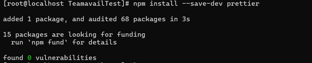
   Adding file .prettierrc
   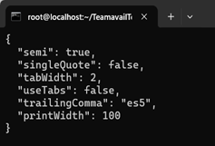
   Adding this 2 lines in package.json in "scripts":
   "format": "prettier --write \"**/*.{js,html,css,json}\""                      >> to edit
   "format:check": "prettier --check \"**/*.{js,html,css,json}\""     >> to check
   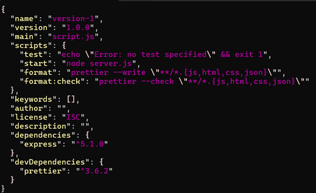
   Now u can run check, edit if u want:
   npm run format                                                    >> to edit on all the project
   npx prettier --write public/script.js             >>to edit to  a specific files
   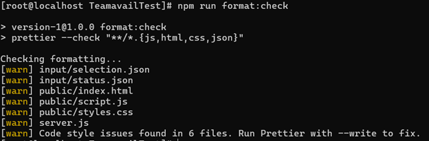
   Now for linting , the tool we will use is ESLint for js, Stylelint for css, HTMLHint for html
   npm install --save-dev eslint stylelint stylelint-config-standard htmlhint
   npx eslint –init
   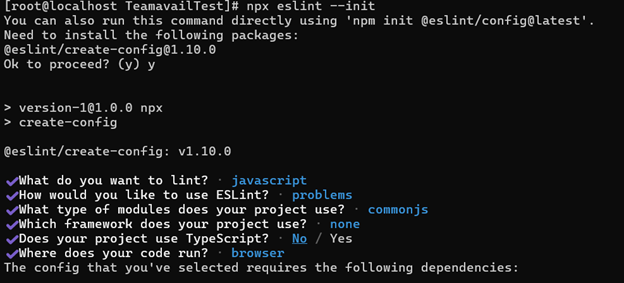
   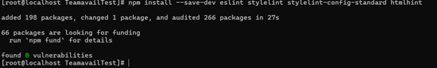
   Then adding those files
   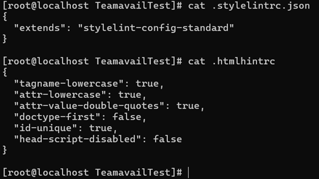

Now adding those lines in package.json

```text
  "lint:js": "eslint . --ext .js",
  "lint:css": "stylelint \"**/*.css\"",
  "lint:html": "htmlhint \"**/*.html\"",
  "lint": "npm run lint:js && npm run lint:css && npm run lint:html"
```

 • Run tests.
  We have integration test and unit test
  In this step we will use unittest on js and the tool we will use is jest and supertest

```json
  npm install --save-dev jest supertest
```

  now adding those 2 lines in package.js

```text
  "test:unit": "jest *.unit.test.js",
  "test:integration": "jest*.integration.test.js"
```

  I faced a problem that there is a proves uses port 3000 and when I keill it it recreated again so I decided to see the pid and see what make it run automatically and then disable it

```bash
  ps -fp PID
  systemctl list-units | grep my_node_app
  systemctl status my_node_app
  systemctl stop my_node_app
```

  now after we solve it lets complete our steps
  create this file server.unit.test.js for unittest u have it in the project take a look
  And this file server.integration.test.js for integration test
  And now we need to edit server.js to be compatible with unittest & integration test u have server.js also in the project
  Now when u run

```bash
  npm run test:unit & npm run test:integration
```

 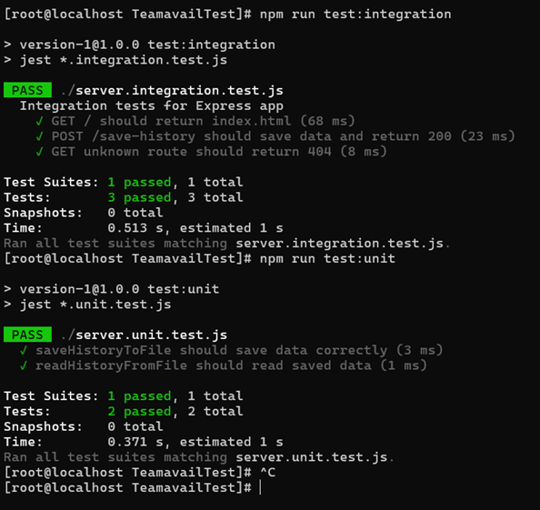

 • Build a Docker image of the application.
  • Start the application using Docker Compose.
    When I start to write ci.sh and run it I faced a problem that in npm run lint:js I see

```text
    > version-1@1.0.0 lint:js
    > eslint . --ext .js
    /root/Building-a-CI-CD-Pipeline-for-the-Availability-Tracker/server.integration.test.js
   4:1  error  'describe' is not defined  no-undef
   5:3  error  'test' is not defined      no-undef
   7:5  error  'expect' is not defined    no-undef
  10:3  error  'test' is not defined      no-undef
  16:5  error  'expect' is not defined    no-undef
  19:3  error  'test' is not defined      no-undef
  21:5  error  'expect' is not defined    no-undef
  /root/Building-a-CI-CD-Pipeline-for-the-Availability-Tracker/server.unit.test.js
   7:1  error  'afterAll' is not defined  no-undef
  11:1  error  'test' is not defined      no-undef
  14:3  error  'expect' is not defined    no-undef
  15:3  error  'expect' is not defined    no-undef
  18:1  error  'test' is not defined      no-undef
  20:3  error  'expect' is not defined    no-undef
  ✖ 13 problems (13 errors, 0 warnings)

```

And this because of the eslint see the test files as a read files and u need to tell him those files for jest test by adding this section in eslint.config

```json
{
    files: ["**/*.test.js", "**/*.spec.js"],
    languageOptions: {
      globals: {
        ...globals.node,
        ...globals.jest,
      },
    },
  },
```

Now we have ci.sh (u have it in the project)

Optional Extensions
  Instead of using ci.sh we can use Jenkins , u just need to install it as an image and run it
  U need to make custom image for Jenkins

  Here I faced a problem when I run

```basg
  docker run -d -p 9090:8080 -p 50000:50000 -v jenkins_home:/var/jenkins_home -v /var/run/docker.sock:/var/run/docker.sock jenkins-custom:latest
```

it said u run out of space , so I decide to expand the size in vm then resize it

```text
[root@localhost ~]# sudo fdisk /dev/sda

Welcome to fdisk (util-linux 2.37.4).
Changes will remain in memory only, until you decide to write them.
Be careful before using the write command.

This disk is currently in use - repartitioning is probably a bad idea.
It's recommended to umount all file systems, and swapoff all swap
partitions on this disk.

Command (m for help): p

Disk /dev/sda: 40 GiB, 42949672960 bytes, 83886080 sectors
Disk model: VMware Virtual S
Units: sectors of 1 * 512 = 512 bytes
Sector size (logical/physical): 512 bytes / 512 bytes
I/O size (minimum/optimal): 512 bytes / 512 bytes
Disklabel type: dos
Disk identifier: 0xa228537f

Device     Boot   Start      End  Sectors Size Id Type
/dev/sda1  *       2048  2099199  2097152   1G 83 Linux
/dev/sda2       2099200 41943039 39843840  19G 8e Linux LVM

Command (m for help): d
Partition number (1,2, default 2): 2

Partition 2 has been deleted.

Command (m for help): n
Partition type
   p   primary (1 primary, 0 extended, 3 free)
   e   extended (container for logical partitions)
Select (default p): p
Partition number (2-4, default 2): 2
First sector (2099200-83886079, default 2099200):
Last sector, +/-sectors or +/-size{K,M,G,T,P} (2099200-83886079, default 83886079):

Created a new partition 2 of type 'Linux' and of size 39 GiB.
Partition #2 contains a LVM2_member signature.

Do you want to remove the signature? [Y]es/[N]o: N

Command (m for help): t
Partition number (1,2, default 2): 2
Hex code or alias (type L to list all): L

00 Empty            24 NEC DOS          81 Minix / old Lin  bf Solaris
01 FAT12            27 Hidden NTFS Win  82 Linux swap / So  c1 DRDOS/sec (FAT-
02 XENIX root       39 Plan 9           83 Linux            c4 DRDOS/sec (FAT-
03 XENIX usr        3c PartitionMagic   84 OS/2 hidden or   c6 DRDOS/sec (FAT-
04 FAT16 <32M       40 Venix 80286      85 Linux extended   c7 Syrinx
05 Extended         41 PPC PReP Boot    86 NTFS volume set  da Non-FS data
06 FAT16            42 SFS              87 NTFS volume set  db CP/M / CTOS / .
07 HPFS/NTFS/exFAT  4d QNX4.x           88 Linux plaintext  de Dell Utility
08 AIX              4e QNX4.x 2nd part  8e Linux LVM        df BootIt
09 AIX bootable     4f QNX4.x 3rd part  93 Amoeba           e1 DOS access
0a OS/2 Boot Manag  50 OnTrack DM       94 Amoeba BBT       e3 DOS R/O
0b W95 FAT32        51 OnTrack DM6 Aux  9f BSD/OS           e4 SpeedStor
0c W95 FAT32 (LBA)  52 CP/M             a0 IBM Thinkpad hi  ea Linux extended
0e W95 FAT16 (LBA)  53 OnTrack DM6 Aux  a5 FreeBSD          eb BeOS fs
0f W95 Ext'd (LBA)  54 OnTrackDM6       a6 OpenBSD          ee GPT
10 OPUS             55 EZ-Drive         a7 NeXTSTEP         ef EFI (FAT-12/16/
11 Hidden FAT12     56 Golden Bow       a8 Darwin UFS       f0 Linux/PA-RISC b
12 Compaq diagnost  5c Priam Edisk      a9 NetBSD           f1 SpeedStor
14 Hidden FAT16 <3  61 SpeedStor        ab Darwin boot      f4 SpeedStor
16 Hidden FAT16     63 GNU HURD or Sys  af HFS / HFS+       f2 DOS secondary
17 Hidden HPFS/NTF  64 Novell Netware   b7 BSDI fs          fb VMware VMFS
18 AST SmartSleep   65 Novell Netware   b8 BSDI swap        fc VMware VMKCORE
1b Hidden W95 FAT3  70 DiskSecure Mult  bb Boot Wizard hid  fd Linux raid auto
1c Hidden W95 FAT3  75 PC/IX            bc Acronis FAT32 L  fe LANstep
1e Hidden W95 FAT1  80 Old Minix        be Solaris boot     ff BBT

Aliases:
   linux          - 83
   swap           - 82
   extended       - 05
   uefi           - EF
   raid           - FD
   lvm            - 8E
   linuxex        - 85
Hex code or alias (type L to list all): 8E

Changed type of partition 'Linux' to 'Linux LVM'.

Command (m for help): w
The partition table has been altered.
Syncing disks.

[root@localhost ~]# sudo partprobe /dev/sda
[root@localhost ~]# lsblk
NAME        MAJ:MIN RM   SIZE RO TYPE MOUNTPOINTS
sda           8:0    0    40G  0 disk
├─sda1        8:1    0     1G  0 part /boot
└─sda2        8:2    0    39G  0 part
  ├─cs-root 253:0    0    17G  0 lvm  /
  └─cs-swap 253:1    0     2G  0 lvm  [SWAP]
sr0          11:0    1 157.8M  0 rom
sr1          11:1    1  10.6G  0 rom
[root@localhost ~]# sudo pvresize /dev/sda2
  Physical volume "/dev/sda2" changed
  1 physical volume(s) resized or updated / 0 physical volume(s) not resized
[root@localhost ~]# sudo lvextend -l +100%FREE /dev/mapper/cs-root
  Size of logical volume cs/root changed from <17.00 GiB (4351 extents) to <37.00 GiB (9471 extents).
  Logical volume cs/root successfully resized.
[root@localhost ~]# sudo xfs_growfs /
meta-data=/dev/mapper/cs-root    isize=512    agcount=4, agsize=1113856 blks
         =                       sectsz=512   attr=2, projid32bit=1
         =                       crc=1        finobt=1, sparse=1, rmapbt=0
         =                       reflink=1    bigtime=1 inobtcount=1 nrext64=0
data     =                       bsize=4096   blocks=4455424, imaxpct=25
         =                       sunit=0      swidth=0 blks
naming   =version 2              bsize=4096   ascii-ci=0, ftype=1
log      =internal log           bsize=4096   blocks=16384, version=2
         =                       sectsz=512   sunit=0 blks, lazy-count=1
realtime =none                   extsz=4096   blocks=0, rtextents=0
data blocks changed from 4455424 to 9698304
[root@localhost ~]# df -h /
Filesystem           Size  Used Avail Use% Mounted on
/dev/mapper/cs-root   37G   17G   21G  46% /
[root@localhost ~]#
```

Then u can run this

```bash
 docker run -d -p 9090:8080 -p 50000:50000 -v jenkins_home:/var/jenkins_home -v /var/run/docker.sock:/var/run/docker.sock jenkins-custom:latest
```

but u need to write and build the custom Jenkins , and this custom image to install all requirement u need to run ur pipline
the custom Jenkins u will have it too in the project

and to connect between github and Jenkins , u can use webhook and cuz we are in lockal environment so u can use ngrok to make it publick and github see u
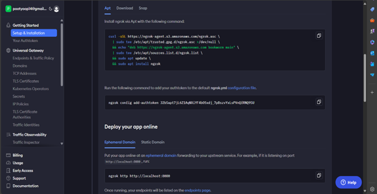
Then run this

```bash
 ngrok http 9090
```

and now u will see this
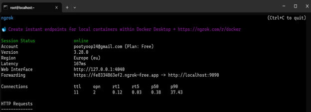
Now u can manage webhook in github
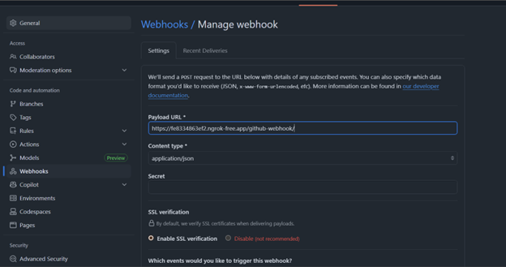
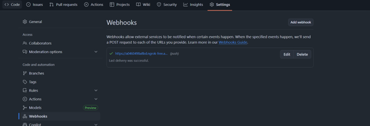

Then u need to make a Jenkins pipeline (this kind of Jenkins will alternativlly of ci.sh)
after u run it the project will be ready in lockalhost:8080
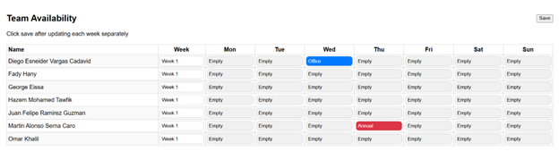

Lets now to go to the cloud part
u need to write a terraform to make , and we will work in GCP
  **vpc access to make connection between redis and cloud run**
  **and make reids to save data**
  **and run image in cloud run**
the terraform code u can see it in the project
now lets go to Jenkins part u will also see the code in the project (dont forget to give Jenkins access to ur cloud using IAM)
Jenkins will build and push the image in docker registry to make cloud run pull it and run it and run the terraform for the infrastucture
this is the image in docker registry
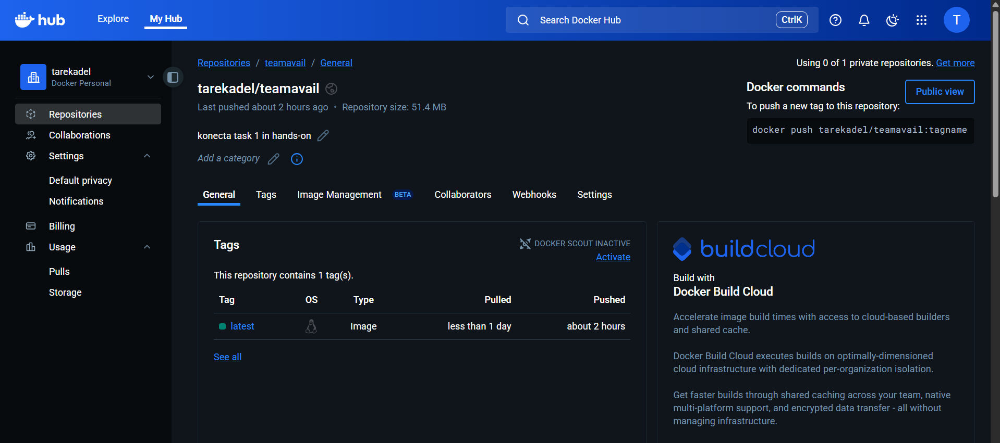
**Before u run the pipeline u need to enable redis services**
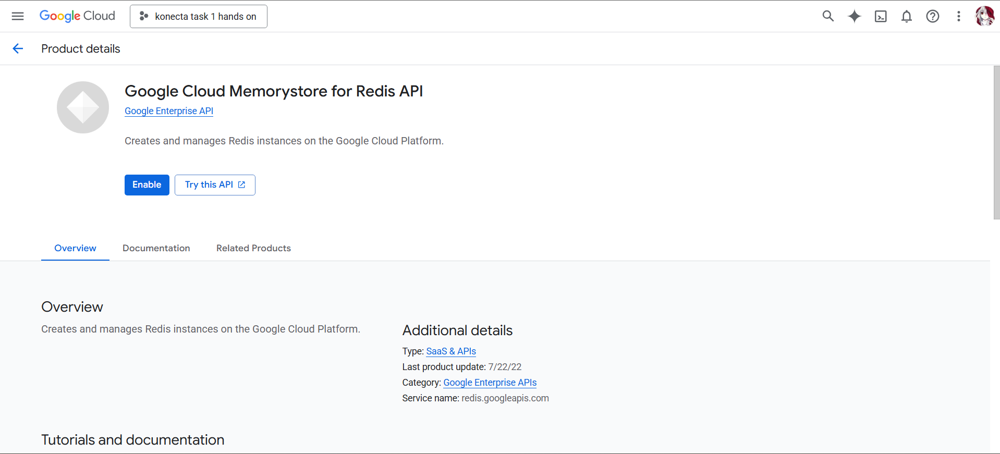
and those the resources of redis and cloud run after creating them by pipeline using terraform
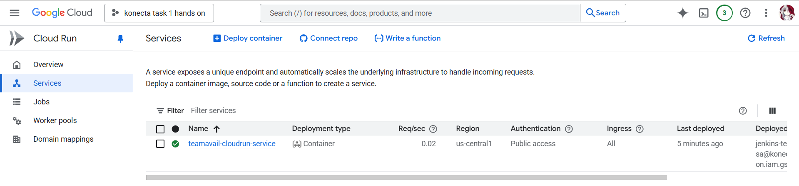
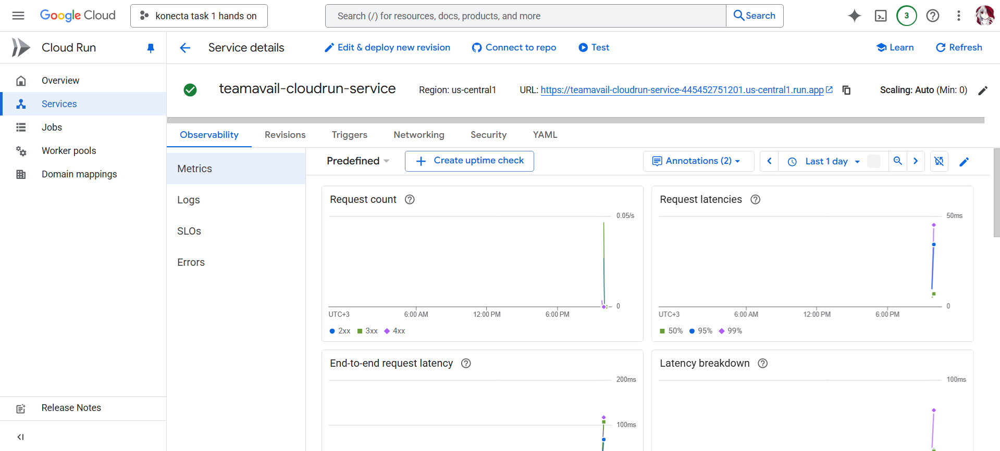
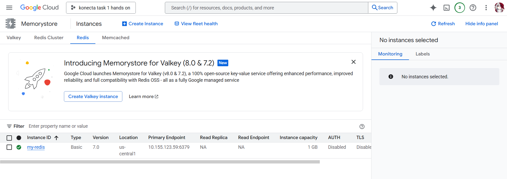
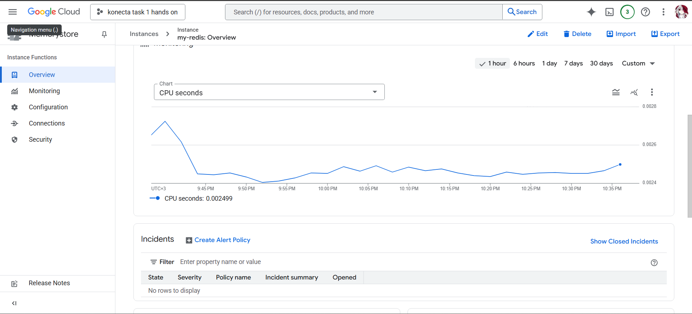
now u have the project using the URL from GCP and u can access it and saving ur work in redis
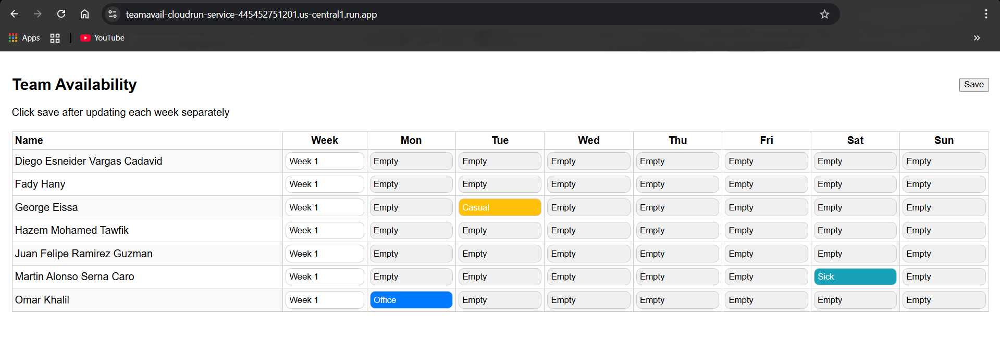

- Cloud Run failed to become ready (PORT 8080):

  - Cause: Server attempted Redis connect during startup and bound only after success.
  - Fix: `server.js` now listens immediately on `0.0.0.0:${PORT}` and connects to Redis in the background; added `/healthz`.
- Container failed health checks due to PORT mismatch:

  - Cause: Cloud Run expects 8080; clarified app PORT logic and Dockerfile exposes 8080.
  - Fix: Ensure no custom PORT in Cloud Run; compose maps host 3000 → container 8080 for local use.
- Terraform used `REDIS_HOST`/`REDIS_PORT` (unused by app):

  - Fix: Switched to `REDIS_URL=redis://<memorystore-ip>:6379` in Cloud Run env.
- Cloud Run couldn’t reach Redis (private IP):

  - Cause: No Serverless VPC Access connector.
  - Fix: Added `google_vpc_access_connector` and Cloud Run annotations; ensured same region/network.
- VPC connector API/quotas/states:

  - Error: Connector required min/max instances; set `min_instances=2`, `max_instances=2`.
  - Error: Existing broken connector → 409/bad state.
  - Fix: Delete broken connector, recreate with non-overlapping `/28` range (e.g., `10.9.0.0/28`).
- IAM/API permissions during Terraform:

  - Error: `run.services.setIamPolicy` denied and Cloud Resource Manager API disabled.
  - Fix: Enable APIs (`run`, `vpcaccess`, `redis`, `cloudresourcemanager`) and grant roles to Jenkins SA (`run.admin`, `iam.serviceAccountUser`, `vpcaccess.user`).
- Local Docker Compose networking:

  - Updated compose to map host `3000:8080`; removed PORT env so app defaults to 8080.
  - Use `REDIS_URL=redis://redis:6379` to reach the Redis service.
- Lint/test issues:

  - ESLint `no-empty` fixed; CSS vendor prefixes simplified; tests passing (unit + integration).

With these fixes, local and cloud deployments run reliably, and data persists in Redis when `REDIS_URL` is configured.
